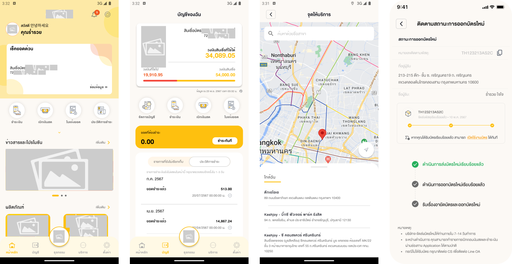
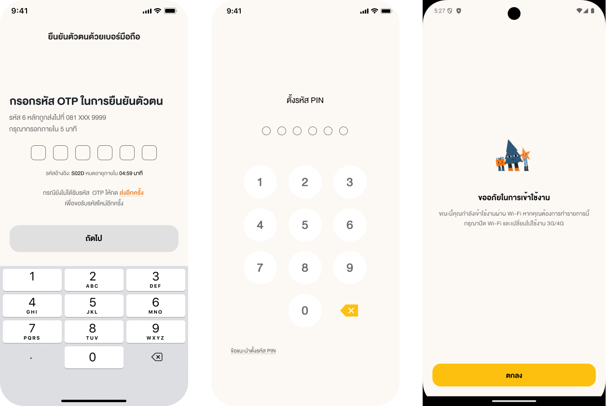
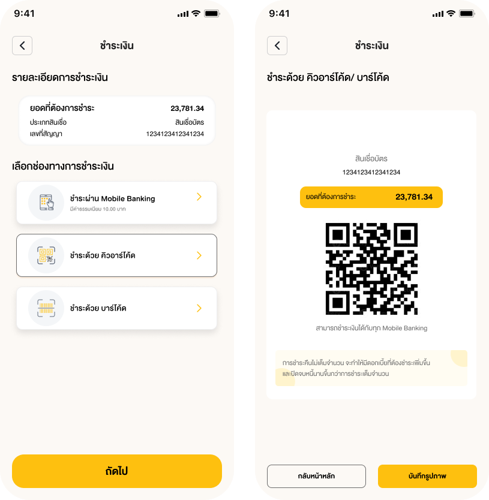
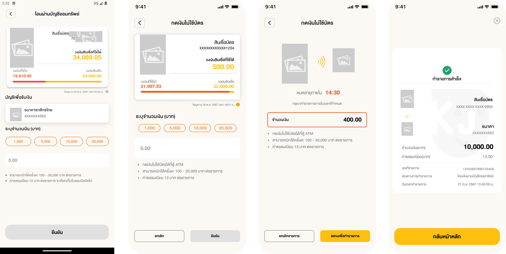

 # 🌟 SphereFinMobile

> **A loan management and payment application** supporting **Cardless withdrawals, QR/Barcode payments, PDF billing, and shop location maps**.
> Built with **Flutter**, following **Clean Architecture** and utilizing **State Management (flutter_bloc + Get_it)**.

---

## 📌 **Table of Contents**
1. [Project Overview](#project-overview)
2. [Key Features](#key-features)
3. [Screenshots & UI Flow](#screenshots--ui-flow)
4. [Project Structure](#project-structure)
5. [Installation & Setup](#installation--setup)
6. [State Management & Architecture](#state-management--architecture)
7. [CI/CD & Deployment](#cicd--deployment)

---

## 🏆 **Project Overview**

**SphereFinMobile** is a **loan management and payment application** designed for seamless transactions, high security, and support for **multi-environment configurations (mock, sit, prod)**.

### 🛠 **Technologies Used**
- **Flutter (Dart)** – Uses **flutter_bloc (Cubit)** for State Management.
- **Get_it** – Dependency Injection.
- **Firebase** – Supports FCM and Analytics.
- **Fastlane** – Automated CI/CD deployment.
- **Google Maps API** – For shop location services.


---

## 🚀 **Key Features**

**Cardless Withdrawal** – Withdraw money directly from the loan account.  
**QR/Barcode Payment** – Scan QR Codes or Barcodes for seamless payments.  
**PDF Billing** – View and download loan statements in PDF format.  
**Shop Location Map** – Locate shops using an interactive map.  
**User Authentication** – Secure login system.  

---

## 📸 **Screenshots & UI Flow**

🏠 Dashboard & Account Overview
<p align="left">  </p>
🔑 Authentication
<p align="left">  </p>
💳 Payment
<p align="left">  </p>
🔄 Withdrawal
<p align="left">  </p>

---
## 🏗️ Project Structure - SphereFinMobile

This project follows **Clean Architecture**, with a well-organized folder structure:

```
assets/
├── config/
│   ├── config_th.json
├── fonts/
├── icons/
├── localizations/
│   ├── th.json

lib/
│
├── common/
│   ├── components/             # Shared UI components
│   ├── constants/              # Application-wide constants
│   ├── dialog/                 # Reusable dialog components
│   ├── fullpage/               # Full page popups
│   ├── tools/                  # Utility tools like Formatter, Validator
│
├── core/
│   ├── api/
│   │   ├── api_config.dart     # Maps API config from env
│   │   ├── api_service.dart    # Dio Interceptor
│   ├── configuration/
│   │   ├── app_config.dart     # Loads asset config_th.json or API config_th
│   │   ├── app_flavor.dart     # Maps Flavor configurations
│   │   ├── placeholder_key.dart # Keys for text placeholders
│   │   ├── storage_key.dart    # Keys for local storage
│   │   ├── language_config.dart # Enum for supported languages
│   ├── localization/
│   │   ├── app_localizations.dart # Loads asset th.json or API json
│   │   ├── model/
│   │   │   ├── common_label.dart
│   │   │   ├── home_label.dart
│   ├── module/
│   │   ├── app_base_module.dart # Abstract class for data, domain layers
│   ├── provider/
│   │   ├── app_provider.dart    # Centralized BlocProvider for features
│   ├── route/
│   │   ├── app_route.dart       # Route name mapping
│   ├── state/
│   │   ├── app_cubit.dart       # Abstract Cubit with init(), clear()
│   │   ├── app_state.dart       # Abstract Stateful screen base
│
├── data/
│   ├── model/                   # JSON Object representations from API
│   ├── repository/
│   │   ├── mock_ex_repository.dart # Mock API data
│   │   ├── remote_ex_repository.dart # Actual API calls via Dio
│
├── domain/
│   ├── repository/
│   │   ├── ex_repository.dart   # Abstract API repository interface
│
├── delegate/
│   ├── app_storage_mixin.dart   # Storage handling mixin
│   ├── application_mixin.dart   # Global functions like showAlert
│   ├── config_mixin.dart        # Simplified access to config_th.json
│   ├── localization_mixin.dart  # Simplified access to th.json
│
├── di/
│   ├── app_module.dart          # Registers dependencies in Get_it
│
├── extensions/
│   ├── date_extension.dart
│   ├── string_extension.dart
│   ├── number_extension.dart
│
├── theme/
│   ├── app_colors.dart          # App color definitions
│   ├── app_textstyle.dart       # Text styles
│   ├── app_theme.dart           # Base theme components
│
├── features/
│   ├── example/
│   │   ├── config/
│   │   │   ├── example_module.dart  # Dependency module
│   │   │   ├── example_provider.dart # BlocProvider for the feature
│   │   │   ├── example_route.dart   # Route mappings for the feature
│   │   ├── data/
│   │   │   ├── models/
│   │   │   │   ├── example_model.dart
│   │   │   ├── repositories/
│   │   │   │   ├── mock_example_repository.dart
│   │   │   │   ├── remote_example_repository.dart
│   │   ├── domain/
│   │   │   ├── repositories/
│   │   │   │   ├── example_repository.dart
│   │   ├── presentation/
│   │   │   ├── example_cubit.dart
│   │   │   ├── example_state.dart
│   │   │   ├── example_screen.dart
```

---

## 🏛️ **State Management & Architecture**

This project follows **Clean Architecture** and is divided into three main layers:

1️⃣ **Data Layer** – Handles API requests, local database operations, and data modeling.  
2️⃣ **Domain Layer** – Contains business logic and use cases.  
3️⃣ **Presentation Layer** – Manages UI and state using Bloc (Cubit).  

---

## 🛠 **Installation & Setup**

### 📌 Install Dependencies
```bash
fvm flutter pub get
```

### 📌 Run App Based on Environment
```bash
fvm flutter run --flavor mock -t lib/main_mock.dart
fvm flutter run --flavor sit -t lib/main_sit.dart
fvm flutter run --flavor prod -t lib/main_prod.dart
```

### 📌 Deploy Using Fastlane
```bash
sh deploy-prod.sh  # For Production
sh deploy-sit.sh   # For SIT
```

---

## ⚙️ **CI/CD & Deployment**

- **Android**: Uses **Firebase App Distribution** for testing.
- **iOS**: Uses **TestFlight** for internal testing.
- **Fastlane**: Automates the deployment process.

---
